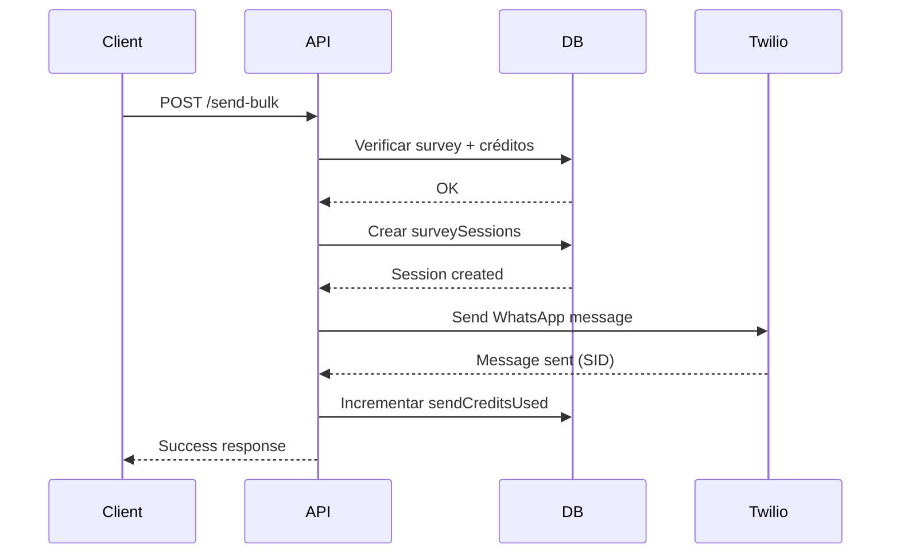

# 📡 API: Bulk Send - Documentación

## Endpoint: Envío Masivo de Encuestas

**Base URL:** `https://app.chatform.mx/api`

---

## POST `/api/surveys/{surveyId}/send-bulk`

Envía una encuesta a un único contacto via WhatsApp.

### Autenticación
Requiere sesión activa (cookie de NextAuth).

### Headers
```http
Content-Type: application/json
Cookie: authjs.session-token=...
```

### Path Parameters
| Parámetro | Tipo | Descripción |
|-----------|------|-------------|
| surveyId | UUID | ID de la encuesta a enviar |

### Body Parameters
```json
{
  "phone": "+5215512345678",
  "name": "Juan Pérez",
  "templateId": "friendly-short",
  "customVariables": {
    "context": "cliente frecuente",
    "incentive": "recibirás 10% descuento"
  }
}
```

| Campo | Tipo | Requerido | Descripción |
|-------|------|-----------|-------------|
| phone | string | ✅ | Teléfono en formato E.164 (+52...) |
| name | string | ❌ | Nombre del contacto |
| templateId | string | ❌ | ID de plantilla (default: "friendly-short") |
| customVariables | object | ❌ | Variables adicionales para la plantilla |

### Validaciones

#### Phone Number
```javascript
Formato: /^\+\d{10,15}$/
Ejemplos válidos:
  ✅ +5215512345678
  ✅ +521234567890
  ❌ 5512345678 (falta +52)
  ❌ +52 55 1234 5678 (tiene espacios)
```

#### Survey Status
```javascript
- Survey debe existir
- Survey debe pertenecer al tenant del usuario
- Survey.status debe ser "active"
```

#### API Key
```javascript
- Tenant debe tener apiKeyHash (generada en Settings)
- Es obligatoria para envíos masivos
```

#### Credits
```javascript
- sendCreditsUsed < sendCreditsLimit
- Se consume 1 crédito por envío exitoso
- No se consumen créditos si el envío falla
```

### Response

#### Success (200)
```json
{
  "status": "sent",
  "deliveryMethod": "automatic",
  "messageId": "SMxxxxxxxxxxxxxxxxxxxxxxxxxxxxxxxx",
  "sessionId": "uuid-xxxxx-xxxxx"
}
```

#### Link Generated - Twilio no configurado (200)
```json
{
  "status": "link_generated",
  "deliveryMethod": "link",
  "link": "https://app.chatform.mx/s/ABC123",
  "message": "Twilio not configured, link generated instead"
}
```

#### Errors

##### 401 Unauthorized
```json
{
  "error": "unauthorized"
}
```

##### 400 Bad Request - Teléfono inválido
```json
{
  "error": "invalid_phone",
  "message": "Phone must be in E.164 format (+52...)"
}
```

##### 403 Forbidden - No API Key
```json
{
  "error": "no_api_key",
  "message": "Generate an API key first"
}
```

##### 403 Forbidden - Sin créditos
```json
{
  "error": "no_credits",
  "message": "No send credits available"
}
```

##### 403 Forbidden - Encuesta inactiva
```json
{
  "error": "survey_inactive"
}
```

##### 404 Not Found
```json
{
  "error": "not_found"
}
```

##### 500 Internal Server Error
```json
{
  "error": "send_failed",
  "message": "Failed to send WhatsApp message"
}
```

---

## Flow del Envío



---

## Ejemplos de Uso

### cURL

```bash
curl -X POST https://app.chatform.mx/api/surveys/abc-123/send-bulk \
  -H "Content-Type: application/json" \
  -H "Cookie: authjs.session-token=..." \
  -d '{
    "phone": "+5215512345678",
    "name": "Juan Pérez",
    "templateId": "friendly-short"
  }'
```

### JavaScript (Fetch)

```javascript
const response = await fetch(
  `https://app.chatform.mx/api/surveys/${surveyId}/send-bulk`,
  {
    method: 'POST',
    headers: {
      'Content-Type': 'application/json',
    },
    credentials: 'include', // Incluye cookies de sesión
    body: JSON.stringify({
      phone: '+5215512345678',
      name: 'Juan Pérez',
      templateId: 'friendly-short',
      customVariables: {
        context: 'cliente frecuente'
      }
    })
  }
);

const data = await response.json();
console.log(data);
```

### Python

```python
import requests

url = f"https://app.chatform.mx/api/surveys/{survey_id}/send-bulk"
headers = {
    "Content-Type": "application/json",
    "Cookie": "authjs.session-token=..."
}
payload = {
    "phone": "+5215512345678",
    "name": "Juan Pérez",
    "templateId": "friendly-short"
}

response = requests.post(url, json=payload, headers=headers)
print(response.json())
```

---

## Rate Limiting

### Implementado en Cliente
```javascript
// 1.1 segundos entre cada envío = ~54 msg/min
for (let i = 0; i < contacts.length; i++) {
  await sendBulk(contacts[i]);

  if (i < contacts.length - 1) {
    await new Promise(resolve => setTimeout(resolve, 1100));
  }
}
```

### Límites de Twilio
- **60 mensajes/minuto** por número de WhatsApp
- Exceder este límite resulta en error HTTP 429

### Límites de WhatsApp Business
- **Tier 1 (nuevo):** 1,000 mensajes/día
- **Tier 2:** 10,000 mensajes/día
- **Tier 3:** 100,000 mensajes/día

---

## Database Changes

### surveySessions
```sql
INSERT INTO survey_sessions (
  survey_id,
  tenant_id,
  phone_number,
  whatsapp_name,
  status,
  current_question_index,
  delivery_method
) VALUES (
  'uuid-survey',
  'uuid-tenant',
  '+5215512345678',
  'Juan Pérez',
  'active',
  -1,
  'automatic'
);
```

### tenants (credits)
```sql
UPDATE tenants
SET send_credits_used = send_credits_used + 1
WHERE id = 'uuid-tenant'
  AND send_credits_used < send_credits_limit;
```

---

## Plantillas Disponibles

### friendly-short
```
¡Hola {{name}}! 👋

Queremos saber tu opinión sobre {{topic}}.
Son solo {{question_count}} preguntas rápidas.

{{link}}

¡Tu feedback nos ayuda mucho! 🙌
```

### professional-detailed
```
Hola {{name}}, soy {{sender}} de {{company}}.

Nos gustaría conocer tu opinión sobre {{topic}}.

📊 Solo {{question_count}} preguntas
⏱️ Tiempo estimado: {{estimated_time}} min

{{link}}

¡Gracias por tu tiempo!
```

### direct-minimal
```
{{name}}, tu opinión sobre {{topic}}:

{{link}}

{{question_count}} preguntas | {{estimated_time}} min
```

### incentive-focused
```
Hola {{name}},

Tu opinión vale mucho. Responde nuestra encuesta sobre {{topic}} y {{incentive}}.

{{link}}

Solo {{estimated_time}} minutos 🎁
```

### personalized-context
```
Hola {{name}},

Como {{context}}, nos gustaría conocer tu experiencia con {{topic}}.

Tu feedback es muy valioso:
{{link}}

Son {{question_count}} preguntas breves.

Saludos,
{{sender}}
```

### link-only
```
{{link}}
```

---

## Testing

### Unit Tests
```bash
npm test -- bulk-send
```

### Integration Tests
```javascript
describe('POST /api/surveys/[id]/send-bulk', () => {
  it('should send WhatsApp message successfully', async () => {
    const response = await fetch('/api/surveys/test-id/send-bulk', {
      method: 'POST',
      body: JSON.stringify({
        phone: '+5215512345678',
        name: 'Test User'
      })
    });

    expect(response.status).toBe(200);
    expect(response.json()).toMatchObject({
      status: 'sent',
      deliveryMethod: 'automatic'
    });
  });

  it('should reject invalid phone format', async () => {
    const response = await fetch('/api/surveys/test-id/send-bulk', {
      method: 'POST',
      body: JSON.stringify({
        phone: '5512345678' // Missing +52
      })
    });

    expect(response.status).toBe(400);
  });
});
```

---

## Troubleshooting

### Mensaje no llega
```
1. Verificar formato de teléfono (+52...)
2. Confirmar que Twilio está configurado
3. Revisar logs de Twilio Console
4. Verificar que número está en Sandbox (dev) o WhatsApp aprobado (prod)
```

### Error "no_credits"
```
1. Ir a Settings → Billing
2. Verificar plan actual
3. Aumentar límite de créditos
4. O upgrade de plan
```

### Error "no_api_key"
```
1. Ir a Settings → API
2. Click "Generate API Key"
3. Guardar key generada
4. Reintentar envío
```

---

**Última actualización:** 2025-11-03
**Versión:** 1.0
